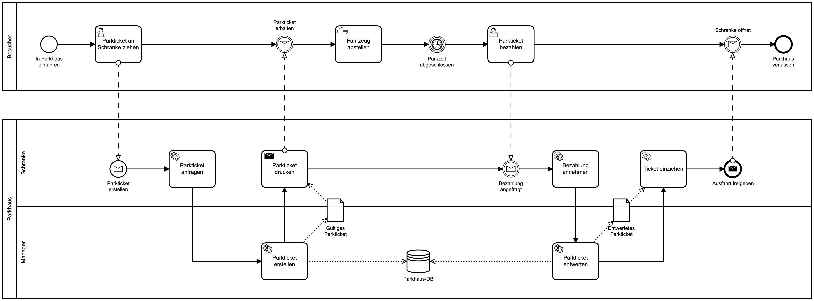

# Parkhaus Micronaut



## Getting started

### Local Machine

#### Parkhaus Manager

```
cd parkhaus-manager/
```

##### Build

```
mvn clean install
```

##### Run

```
java -jar target/parkhaus-manager-micronaut-1.0-SNAPSHOT.jar 
```

#### Parkhaus Schranke

```
cd parkhaus-schranke/
```

##### Build

```
mvn clean install
```

##### Run

```
java -jar target/parkhaus-schranke-micronaut-1.0-SNAPSHOT.jar

```


### Native Image

Die Anwendung kann auch als GraalVM Native Image kompiliert werden.

#### Image bauen: 

```
cd parkhaus-manager
 mvn package -Dpackaging=docker-native -Pgraalvm

```

#### Container starten: 

```
docker run -p8280:8280 parkhaus-manager-micronaut:latest
```
