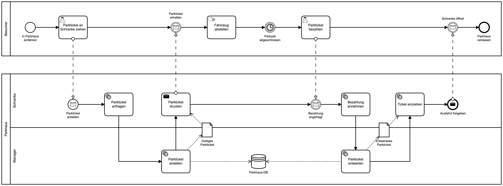

# Parkhaus Spring



## Getting started

### Local Machine

#### Parkhaus Manager

```
cd parkhaus-manager/
```

##### Build

```
mvn clean install
```

##### Run

```
java -jar target/parkhaus-manager-spring-1.0-SNAPSHOT.jar
```

#### Parkhaus Schranke

```
cd parkhaus-schranke/
```

##### Build

```
mvn clean install
```

##### Run

```
java -jar target/parkhaus-schranke-spring-1.0-SNAPSHOT.jar
```


### Native Image

Die Anwendung kann auch als GraalVM Native Image kompiliert werden.

#### Image bauen:

```
cd parkhaus-manager
mvn spring-boot:build-image

```

#### Container starten:

```
docker run -p 8080:8080 docker.io/library/parkhaus-manager-spring:1.0-SNAPSHOT
```
